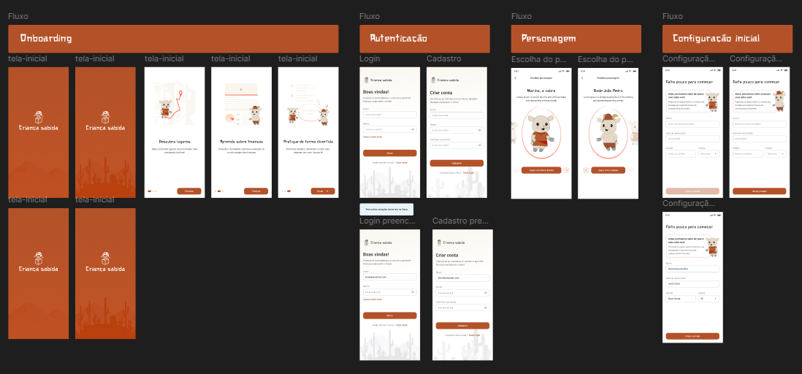

# Criança Sabida by EduCangaço Inc

## Sumário

- [Criança Sabida by EduCangaço Inc](#criança-sabida-by-educangaço-inc)
  - [Sumário](#sumário)
  - [Papéis na equipe](#papéis-na-equipe)
  - [Produto](#produto)
    - [Caracterização da oportunidade](#caracterização-da-oportunidade)
    - [Análise dos competidores](#análise-dos-competidores)
    - [BMG Canvas](#bmg-canvas)
    - [PM Canvas](#pm-canvas)
    - [Protótipo de alta fidelidade](#protótipo-de-alta-fidelidade)
      - [Fluxo](#fluxo)

## Papéis na equipe

| Product Owner     | Scrum Master      |   Developer      |  Developer  | Developer     |
| ----------------- | ----------------- | ---------------- | ----------- | ------------- |
| André Albuquerque | Ismael Cavalcante | Gabriel Oliveira | Ingrid Lima | Wesley Maciel |

## Produto

Criança Sabida é um aplicativo móvel que utiliza tecnologia de Inteligência Artificial (IA) para elaborar perguntas sobre economia, moedas, investimentos e poupança. O aplicativo oferece recompensas em moedas virtuais e penalizações com perdas, permitindo ao usuário aprender sobre transações financeiras simples e a importância da poupança.

O usuário deve decidir quando responder às perguntas, quando não responder ou arriscar em questões financeiramente vantajosas, além de determinar o momento ideal para realizar "negociações". O objetivo é educar de forma lúdica e interativa, facilitando a compreensão dos conceitos financeiros básicos.
Caracterização do Produto.

### Caracterização da oportunidade

A Educação Financeira tem se destacado como um elemento de garantia de vida saudável. Em meio a um cenário global onde as finanças pessoas desempenham um papel fundamental na qualidade de vida e na realização de objetivos, a capacidade de compreender e gerir eficazmente os recursos financeiros se tornou essencial.

Segundo pesquisa global sobre Educação Financeira, S&P Global Finlit Survey, dois em cada três adultos no mundo são analfabetos financeiros. Dos 143 países analisados, o Brasil ficou na 67o posição.
Devido à falta de atenção para com a Educação Financeira, diferentes problemas individuais e coletivos podem emergir. Com isso, compreender e gerir eficazmente os recursos financeiros é essencial.

### Análise dos competidores

[Visualizar arquivo](./Analise%20dos%20competidores.png)

### BMG Canvas

[Visualizar arquivo](./BMG%20Canvas.jpg)

### PM Canvas

[Visualizar arquivo](./PM%20Canvas.jpg)

### Protótipo de alta fidelidade

[Acesso ao Figma](https://www.figma.com/design/8p9ETNCb0uvDovbzWFaws2/Escrita?node-id=4-73&t=Yv4V4wpOxz9p2ogt-0)

#### Fluxo

